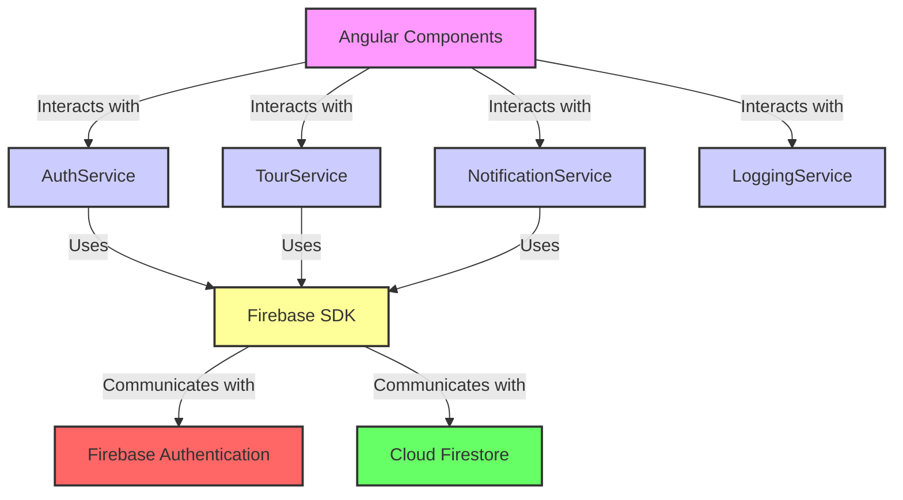

# Application Architecture Review

## Current Architecture Overview:

*   **Framework:** Angular (standalone components).
*   **Backend:** Firebase (Firestore for database, Firebase Auth for authentication).
*   **Structure:** Standard Angular project structure with components, services, models, and guards.
*   **Routing:** Centralized in `src/app/app.routes.ts`, utilizing route guards for authorization.
*   **Key Services:**
    *   `AuthService`: Handles user authentication and profile data.
    *   `TourService`: Manages tour data, applications, participants, and reviews.
    *   `NotificationService`: Intended to handle user notifications.
    *   `LoggingService`: Basic console logging.

## Firestore Data Design Analysis:

Based on component interactions with Firestore services:

1.  **`users` Collection:**
    *   Stores user profiles (`UserData` model: `uid`, `email`, `name`, `photo`, `type` - 'hiker' or 'club').
    *   **Notifications Inconsistency:**
        *   `NotificationWidgetComponent` reads notifications via `notificationService.getUserNotifications()`, which implies a `notifications` subcollection (`users/{userId}/notifications`).
        *   `TourParticipantsComponent` sends notifications via `notificationService.sendNotification()`, which writes to a `notifications` array field within the user document.
        *   `NotificationWidgetComponent` marks notifications as read by updating this array by index.
        *   **Conclusion:** Notification storage needs consolidation. A subcollection approach is generally more scalable.

2.  **`tours` Collection:**
    *   Stores tour details (`Tour` model).
    *   **Denormalized Participant Data:** Contains `participantsIds: string[]`, `participantsNames: string[]`, `participantsPhotos: string[]`. Updated when a club accepts an application. This speeds up reads but poses consistency challenges if user details (name/photo) change.
    *   **`applications` Subcollection (`tours/{tourId}/applications/{userId}`):**
        *   Stores individual applications (`Application` model). Document ID is the applicant's `userId`.
        *   Queried by `TourDetailsComponent` (single application) and `TourParticipantsComponent` (all applications for a tour).
    *   **`reviews` Subcollection (`tours/{tourId}/reviews/{reviewId}`):**
        *   Stores reviews (`Review` model).
        *   Currently created by `MyToursComponent`.

3.  **Key Query Patterns & Considerations:**
    *   **Fetching All Tours (`HomeComponent`):** `tourService.getAllTours()` reads the entire `tours` collection. May need pagination/filtering for larger datasets.
    *   **Fetching User's Applied Tours (`MyToursComponent`):** `tourService.getUserAppliedTours()` uses a `collectionGroup` query on `applications`, then fetches each tour document individually (N+1 query pattern).
        *   **Potential Improvement:** Denormalize essential tour info (name, date) into application documents or batch tour reads.
    *   **Data Consistency for Denormalized Info:**
        *   Tour documents store `clubName`, `clubPhoto`.
        *   Application and Review documents store `userName`, `userPhoto`.
        *   Changes to source user/club profiles will make this denormalized data stale. Consider Firebase Functions for propagation or fetching fresh data on display.

## Firestore Data Design Diagram:

```mermaid
graph TD
    subgraph FirestoreDB [Cloud Firestore]
        direction LR

        UsersCollection["Users (users)"]
        ToursCollection["Tours (tours)"]

        UsersCollection -- "Contains" --> UserDocument["User Document\n(/{userId})\n\n- uid\n- email\n- name\n- photo\n- type ('hiker'/'club')\n- notifications: Array<Notification> (used by send/markAsRead)"]
        UserDocument -- "Can have subcollection" --> UserNotificationsSubcollection["Notifications Subcollection\n(/{userId}/notifications/{notificationId})\n\n- message\n- type\n- read\n- createdAt\n(used by getUserNotifications)"]


        ToursCollection -- "Contains" --> TourDocument["Tour Document\n(/{tourId})\n\n- clubId (ref to UserDoc where type='club')\n- clubName (denormalized)\n- clubPhoto (denormalized)\n- name\n- date\n- gpxContent\n- ...\n- participantsIds: Array<string>\n- participantsNames: Array<string>\n- participantsPhotos: Array<string>"]

        TourDocument -- "Has subcollection" --> ApplicationsSubcollection["Applications Subcollection\n(/{tourId}/applications/{userId})\n\n- userId (applicant)\n- userName (denormalized)\n- userPhoto (denormalized)\n- status\n- timestamp"]
        TourDocument -- "Has subcollection" --> ReviewsSubcollection["Reviews Subcollection\n(/{tourId}/reviews/{reviewId})\n\n- userId (reviewer)\n- userName (denormalized)\n- userPhoto (denormalized)\n- review\n- rating\n- timestamp"]

    end

    %% Relationships / Data Flow Notes
    note1[Note: 'clubId' in TourDocument refers to a UserDocument where user.type == 'club']
    note2[Note: Denormalized fields (clubName, userName, etc.) require strategy for updates if source changes.]
    note3[Note: Notification storage is inconsistent (Array in UserDoc vs. Subcollection). Subcollection is generally preferred.]
    note4[Note: `getUserAppliedTours` in TourService results in N+1 queries (1 for applications + N for individual tours).]

    UserDocument -.-> note1
    TourDocument -.-> note1
    TourDocument -.-> note2
    ApplicationsSubcollection -.-> note2
    ReviewsSubcollection -.-> note2
    UserDocument -.-> note3
    UserNotificationsSubcollection -.-> note3
    ApplicationsSubcollection -.-> note4
    TourDocument -.-> note4


    style FirestoreDB fill:#f0f0f0,stroke:#333,stroke-width:2px
    style UsersCollection fill:#lightblue,stroke:#333
    style ToursCollection fill:#lightgreen,stroke:#333
    style UserDocument fill:#e6f3ff,stroke:#333
    style TourDocument fill:#e6ffe6,stroke:#333
    style UserNotificationsSubcollection fill:#d9d9ff,stroke:#333
    style ApplicationsSubcollection fill:#d9ffd9,stroke:#333
    style ReviewsSubcollection fill:#d9ffd9,stroke:#333
```

## Initial Service Interaction Diagram:

(This diagram shows the general service layer, not the detailed Firestore structure above)


## Refined Proposed Plan:

1.  **Consolidate Notification Storage & Logic:**
    *   Refactor `NotificationService` to exclusively use a `notifications` subcollection under each user document for storing and managing notifications.
    *   Update `NotificationWidgetComponent` to read from and mark notifications as read within this subcollection.
    *   Modify `TourParticipantsComponent` (and any other notification-sending places) to use the refactored `NotificationService` methods that write to the subcollection.
    *   Ensure all intended notification triggers (e.g., new application, status change, review posted) are implemented using the consolidated service.

2.  **Address Denormalization Strategies:**
    *   **Participant Data in Tours:**
        *   Evaluate the trade-offs of the current denormalized `participantsIds`, `participantsNames`, `participantsPhotos` arrays in tour documents.
        *   Consider alternatives:
            *   Fetching participant details on demand when displaying tour participants (more reads, simpler writes).
            *   Implementing Firebase Functions to automatically update these arrays if a user's name/photo changes (more complex, but ensures consistency).
        *   Decide on and document the chosen strategy.
    *   **User/Club Info in Other Collections:**
        *   For denormalized data like `clubName`/`clubPhoto` in tours, and `userName`/`userPhoto` in applications/reviews:
        *   Define a strategy for managing consistency (e.g., Firebase Functions for updates, periodic batch updates, or accepting potential staleness for read performance).

3.  **Optimize Firestore Queries & Data Fetching:**
    *   **`getUserAppliedTours` (N+1 pattern in `TourService`):**
        *   Implement a solution to mitigate the N+1 queries. Options:
            *   Denormalize essential tour information (e.g., tour name, date, thumbnail) into the `application` documents when an application is made.
            *   If Firestore batch capabilities allow, refactor to fetch multiple tour documents more efficiently after getting application IDs.
    *   **Indexing:** Proactively review and ensure all necessary Firestore composite indexes for `collectionGroup` queries and other complex filtering/sorting operations are created and maintained.
    *   **Pagination/Filtering for `getAllTours`:** As the application scales, assess the need for pagination or more specific filtering options in `HomeComponent` to improve performance and user experience.

4.  **Data Model for Reviews and Applications:**
    *   Confirm that storing `applications` and `reviews` as subcollections under each `tour` document remains the optimal approach. (Currently seems fine).