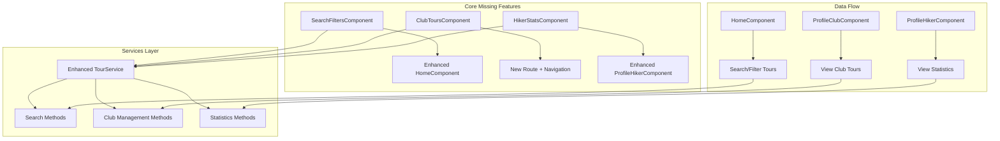

# Missing Functionalities Implementation Plan

## Overview
This document outlines the implementation plan for missing functionalities identified in the mountaineering club application by comparing the initial requirements with the current implementation.

## Analysis Summary
After examining the initial functionalities document, architecture review, issues overview, user scenarios, and source code, the key gaps identified between specified requirements and current implementation are:

## Missing Functionalities Identified

### **Core Missing Features:**
1. **Tour Search & Filtering** - Initial requirement: "Review and search of announced tours"
   - Current implementation only shows all tours without search/filter capabilities
   - Missing search by tour name, club name, difficulty, location, date range

2. **Club Tours Management View** - Initial requirement for clubs to manage their tours
   - No dedicated route/component for clubs to view their own created tours
   - Current `ProfileClubComponent` only shows count, not actual tour list

3. **Hiker Statistics Dashboard** - Initial requirement: "total number of tours, kilometers traveled, height climbed, etc"
   - `ProfileHikerComponent` missing comprehensive tour statistics

---

## Implementation Plan

### 1. Tour Search & Filtering System (Priority 1)
**Components to Create/Modify:**
- Create `SearchFiltersComponent` - Search and filter UI for tours
- Modify `HomeComponent` - Integrate search functionality
- Enhance `TourService` - Add search/filter methods

**Features:**
- Text search by tour name, club name, description, location
- Filter by difficulty level (easy, moderate, hard)
- Filter by date range (upcoming tours, this month, etc.)
- Filter by available spots
- Sort by date, difficulty, number of participants
- Clear all filters option

**Technical Implementation:**
```typescript
// New interfaces
interface SearchCriteria {
  searchText?: string;
  difficulty?: string;
  dateFrom?: Date;
  dateTo?: Date;
  hasAvailableSpots?: boolean;
  sortBy?: 'date' | 'difficulty' | 'participants';
  sortOrder?: 'asc' | 'desc';
}

// New service methods
searchTours(criteria: SearchCriteria): Promise<Tour[]>
filterToursByText(tours: Tour[], searchText: string): Tour[]
filterToursByDifficulty(tours: Tour[], difficulty: string): Tour[]
filterToursByDateRange(tours: Tour[], startDate: Date, endDate: Date): Tour[]
sortTours(tours: Tour[], sortBy: string, order: string): Tour[]
```

### 2. Club Tours Management View (Priority 2)
**Components to Create/Modify:**
- Create `ClubToursComponent` - Club's own tours management
- Add new route to `app.routes.ts`: `{ path: 'club-tours', component: ClubToursComponent, canActivate: [hikingClubGuard] }`
- Enhance `TourService` - Add club-specific methods

**Features:**
- View all tours created by the club (past and upcoming)
- Quick stats overview (total tours, total participants, average rating)
- Edit/update tour details (redirect to existing edit functionality)
- View tour application statistics
- Quick access to tour participants management

**Technical Implementation:**
```typescript
// New service methods
getClubTours(clubId: string): Promise<Tour[]>
getClubStatistics(clubId: string): Promise<ClubStatistics>

// New interfaces
interface ClubStatistics {
  totalTours: number;
  totalParticipants: number;
  averageRating: number;
  upcomingTours: number;
}
```

### 3. Hiker Statistics Dashboard (Priority 3)
**Components to Create/Modify:**
- Create `HikerStatsComponent` - Statistics dashboard
- Enhance `ProfileHikerComponent` - Integrate stats display
- Add statistics calculation methods to `TourService`

**Features:**
- Total completed tours count
- Total kilometers traveled (calculated from tour GPX data)
- Total elevation gained (calculated from tour GPX data)
- Tours completed by difficulty level
- Recent tour history
- Personal achievements/milestones

**Technical Implementation:**
```typescript
// New interfaces
interface HikerStatistics {
  totalCompletedTours: number;
  totalKilometers: number;
  totalElevationGain: number;
  toursByDifficulty: {
    easy: number;
    moderate: number;
    hard: number;
  };
  recentTours: Tour[];
  lastCalculated: Date;
}

// New service methods
calculateHikerStatistics(userId: string): Promise<HikerStatistics>
getCompletedTours(userId: string): Promise<Tour[]>
calculateDistanceFromGPX(gpxContent: string): number
calculateElevationFromGPX(gpxContent: string): number
```

---

## Implementation Architecture



## Technical Implementation Details

### Enhanced TourService Methods
```typescript
// Search and filtering
searchTours(criteria: SearchCriteria): Promise<Tour[]>
filterToursByText(tours: Tour[], searchText: string): Tour[]
filterToursByDifficulty(tours: Tour[], difficulty: string): Tour[]
filterToursByDateRange(tours: Tour[], startDate: Date, endDate: Date): Tour[]
sortTours(tours: Tour[], sortBy: string, order: string): Tour[]

// Club management
getClubTours(clubId: string): Promise<Tour[]>
getClubStatistics(clubId: string): Promise<ClubStatistics>

// Hiker statistics
calculateHikerStatistics(userId: string): Promise<HikerStatistics>
getCompletedTours(userId: string): Promise<Tour[]>
calculateDistanceFromGPX(gpxContent: string): number
calculateElevationFromGPX(gpxContent: string): number
```

## Implementation Priority & Timeline

**Week 1: Tour Search & Filtering** (Highest Priority)
- Create SearchFiltersComponent with search input and filter options
- Modify HomeComponent to integrate search functionality
- Implement search service methods in TourService

**Week 2: Club Tours Management**
- Create ClubToursComponent to display club's tours
- Add new route for club tours management
- Implement club-specific service methods

**Week 3: Hiker Statistics**
- Create HikerStatsComponent for statistics display
- Implement statistics calculation methods
- Integrate statistics into ProfileHikerComponent

## Technical Considerations

### Search Implementation Strategy
- Client-side filtering for initial implementation (simple and fast)
- Future consideration: Server-side search for scalability
- Debounced search input to improve performance

### Statistics Calculation
- Calculate statistics from existing application/review data
- Cache calculated statistics to improve performance
- Consider background calculation for heavy computations

### UI/UX Considerations
- Mobile-responsive search interface
- Clear visual feedback for active filters
- Easy-to-understand statistics presentation

---

**Document Updated:** 2025-06-14  
**Focus:** Core missing functionalities from initial requirements only
**Next Steps:** Implement tour search & filtering system first as highest priority